# Module 5: Cloud & IaaS on AWS

Provisioning, hardening, and securing a live web server on AWS from scratch, then
recovering it from a total lockout. Everything here was built by hand and understood,
not copied.

**Live result:** https://app.viviancloud.site (served from EC2, secured with HTTPS)

---

## What this module covers

Taking a raw idea to a live, secure, recoverable web server:

- Identity: locking down the root account, working from an IAM user with MFA
- A clean custom VPC, built after diagnosing a broken inherited network
- A hardened Ubuntu EC2 instance (patched, UFW, fail2ban)
- nginx serving a custom page over HTTPS with an auto-renewing Let's Encrypt certificate
- A separate EBS data disk, mounted to survive reboots
- Snapshot backups, a billing alarm, a cost report, and a teardown runbook
- A full key-loss recovery using the EBS disk-swap technique

---

## 1. Identity and account safety

The root account can do anything, including run up unlimited bills if leaked. So the
first move is to lock it away behind MFA and work from a weaker everyday identity.

Root protected with multi-factor authentication:

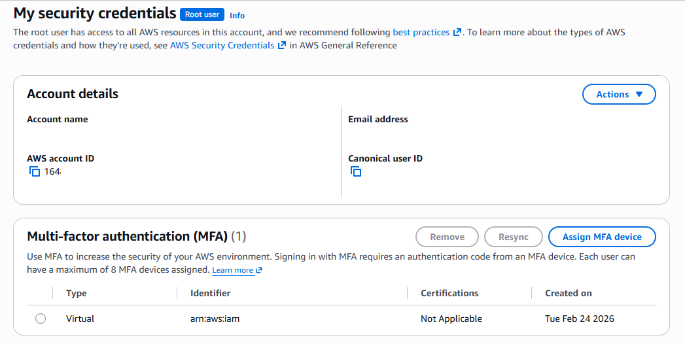

An IAM user (`vivian-admin`) inside an Administrators group, so permissions are managed
on the group and inherited, not pinned to the user:

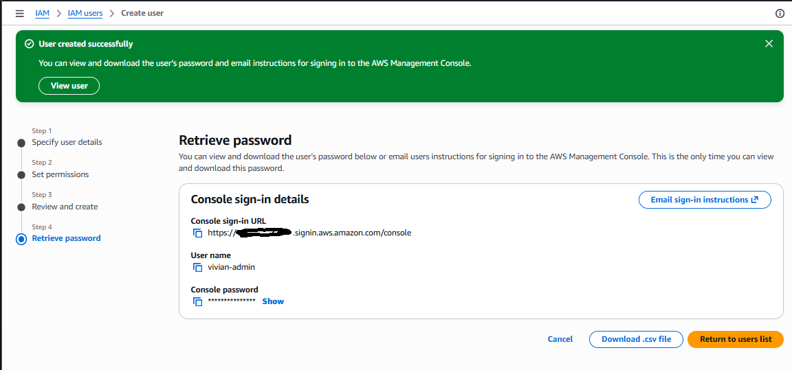

---

## 2. The key pair

An EC2 instance has no password login. Access is by key pair: AWS keeps one half, I
download the other half once and guard it. Lose it and the easy way in is gone.

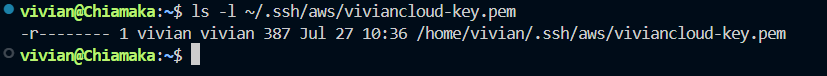

---

## 3. The instance and a broken inherited network

The first launch timed out on SSH despite a correct security group. Diagnosing through
four layers (security group, my IP, subnet route, network ACL) revealed the inherited
subnet had a network ACL that denied all traffic. Rather than patch someone else's
setup, I built my own clean VPC and launched into that.

Instance running in my own VPC, reachable over SSH:

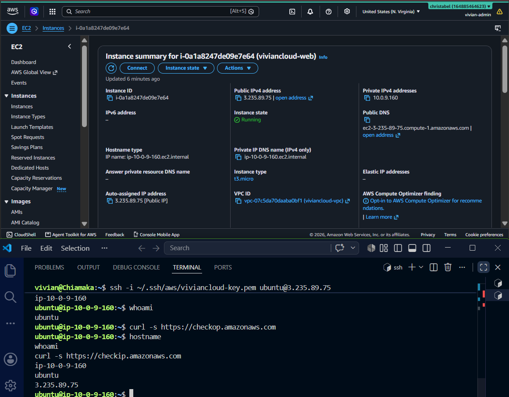

---

## 4. Hardening

Same baseline as a local server, but here the threats are real: a public server is
probed by bots within minutes of going live.

UFW firewall, default-deny with only SSH, HTTP, and HTTPS open:

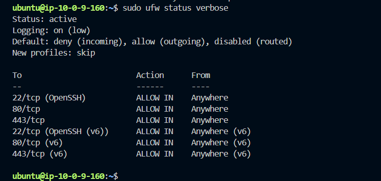

fail2ban running, jailing repeat login offenders:

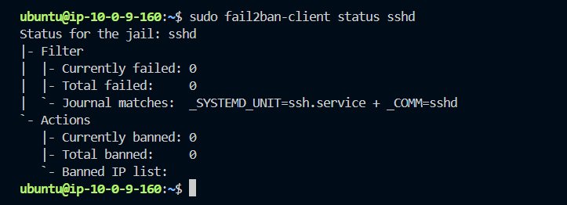

---

## 5. The web server

nginx installed and serving its default page, proving the server answers the internet:

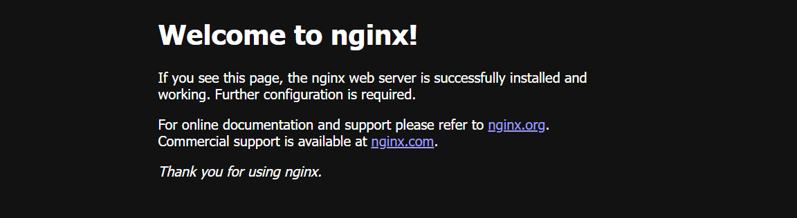

Replaced with my own page:

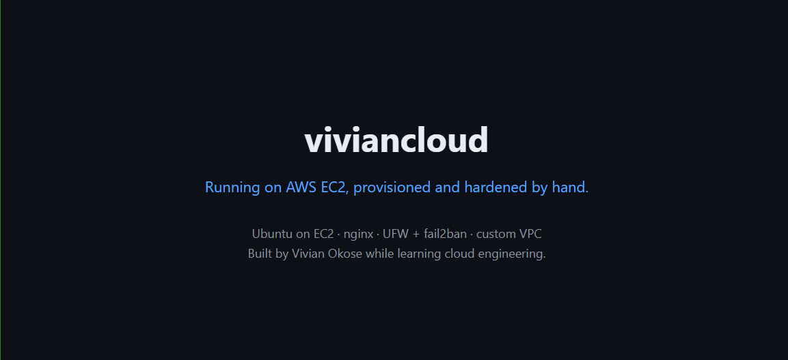

Pointed my real domain at the server via a subdomain (`app.viviancloud.site`), keeping
the main domain on its existing GitHub Pages site:

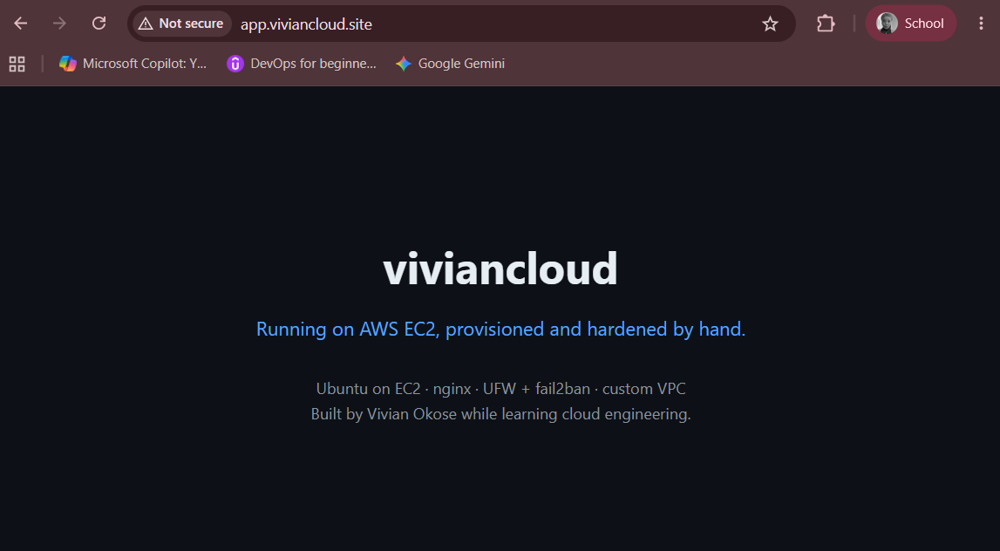

HTTPS with a Let's Encrypt certificate, auto-renewing. The padlock is live:

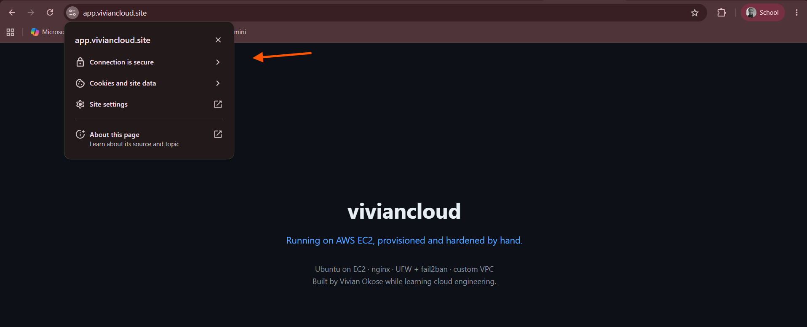

---

## 6. Separate storage

Data belongs on a different disk from the operating system, so the OS can be rebuilt
without touching the data. Attached a 1 GB EBS volume, formatted it, mounted it, and
added it to fstab so the mount survives a reboot (verified by actually rebooting):

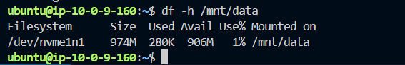

---

## 7. Backup

A snapshot of the boot disk, taken before the recovery drill as a safety net and as the
module's backup deliverable:

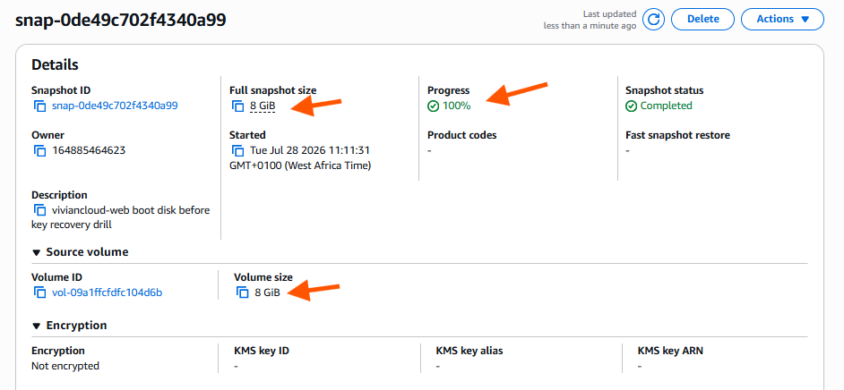

---

## 8. Key-loss recovery (the standout)

I locked myself out of the running server on purpose (emptied its authorized_keys),
confirmed the lockout, then recovered access using the EBS disk-swap technique: stop the
instance, detach its boot disk, attach it to a rescue instance, write my key back onto
the disk, reattach it, and boot. Back in with no data loss.

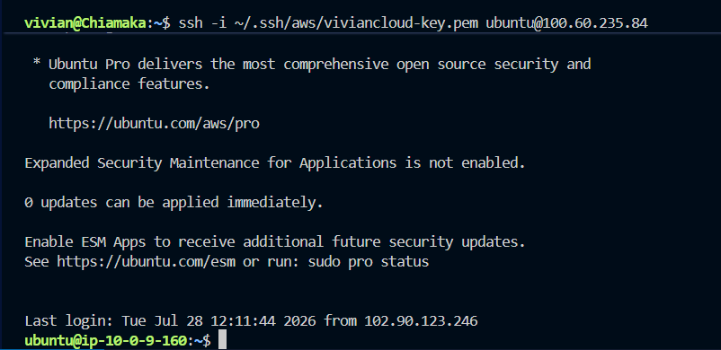

The core idea: the login file lives on the disk, and a disk is a movable object. So even
a server you cannot log into can be fixed by taking its disk somewhere you can reach it.

Other recovery routes exist (EC2 Instance Connect, SSM Session Manager, a user-data
script), but disk-swap always works, with no prior setup and no agent.

---

## 9. Cost discipline

A billing alarm that emails me if estimated charges cross $5, a tripwire so a forgotten
resource cannot quietly run up a bill:

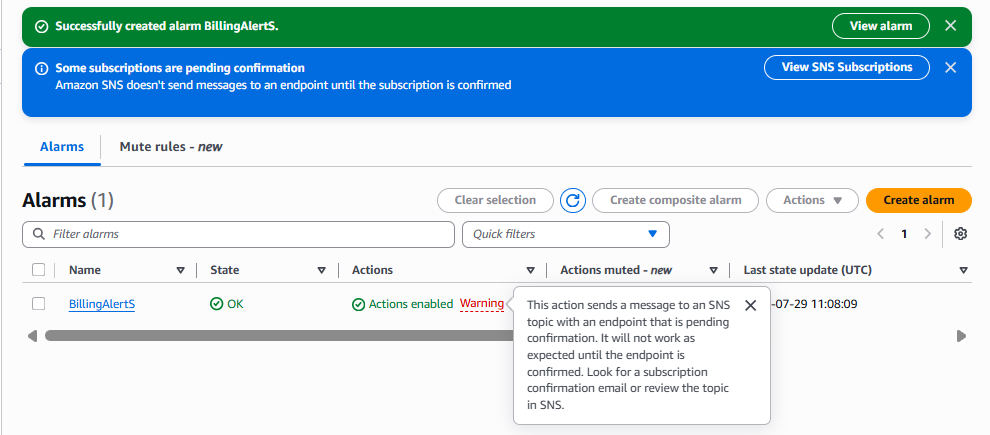

Total cost for the module: **$0.00**, by staying on free-tier resources and stopping the
instance between sessions. See [COST.md](COST.md) for the full breakdown, and
[runbooks/landing-teardown.md](runbooks/landing-teardown.md) for how to remove everything
cleanly.

---

## Files in this module

| File | What it is |
|------|-----------|
| `README.md` | This walkthrough |
| `COST.md` | Cost breakdown and how to avoid surprise bills |
| `retro.md` | What I learned, what surprised me, what I would do next |
| `runbooks/landing-teardown.md` | Step-by-step teardown to reach $0 |
| `screenshots/` | 14 screenshots documenting each step |

---

## Key takeaways

- Cloud bills on existence, not use. Stop what you are not using; release what you no
  longer need.
- Default-deny everything, then open only the specific doors each service needs.
- An EC2 instance accepts any key whose public half is in its authorized_keys file, so
  a lost key is a lock to replace, never a dead end.
- Knowing how to cleanly destroy infrastructure matters as much as building it.
