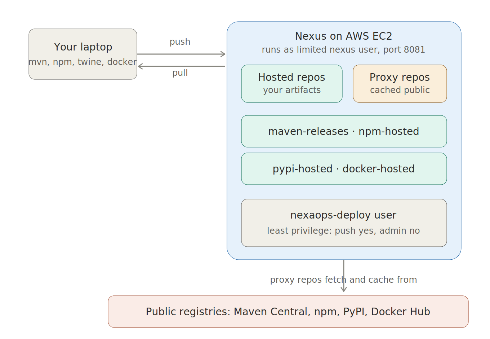

# Module 7: Containers and Docker

Taking a real application, a Node.js delivery app backed by MySQL, and containerising it
to a standard you could actually ship. Not a toy image. A small, non-root, health-checked,
scanned, signed image that runs as a full stack with one command and lives in two
registries.

Everything here was built by hand and understood line by line, not copied.

## The four questions every production image must answer

I used these four questions as my checklist. A naive image fails all four. A production
image answers all four. This whole module is the work of getting from the first to the second.

1. **How small is it?** Smaller means less to attack, faster pulls, less storage.
2. **What is in it?** Scanned, known, documented. No mystery contents.
3. **Who built it?** Signed, so the signature proves it came from me and was not tampered with.
4. **Will it run as root?** No. A non-root user, always.

Here is how I answered each one, and the full walkthrough underneath.

## The whole system at a glance

*The full picture: the app and MySQL containers on a private network, the volume that
keeps data, and the same image pushed to Docker Hub and Nexus. The bottom strip is the
naive-to-production hardening pipeline.*

## The app: SwiftMove Logistics

A small delivery-tracking app. A Node.js web server reads deliveries from a MySQL database
and shows them on a page. Simple enough to understand fully, real enough to need a database,
a private network, persistent storage, and health checks, so it exercises everything.

*The running stack: the Node app serving live data from the MySQL container beside it.*

## Question 1: How small is it?

I started with the worst reasonable Dockerfile on purpose, so I could see the cost before
fixing it. Full Node base image, everything copied in, running as root.

*The naive image: 1.11GB. A whole build toolchain shipped that the running app never uses.*

Then I rebuilt it with a **multi-stage build**: do the messy install work in a throwaway
builder stage, then copy only the finished app into a clean, tiny Alpine runtime stage.
The build tools never ship.

*Same app, two Dockerfiles. 1.11GB down to 133MB, an 88 percent cut.*

I confirmed the layers were lean with dive, which x-rays an image layer by layer.

*99 percent efficiency. The base runtime is the weight; my code and config are kilobytes.*

## Question 4: Will it run as root?

No. The Dockerfile creates a non-root user (UID 10001) and switches to it, so the app
never runs with root powers inside the container. If it is ever compromised, the blast
radius is small.

*docker inspect confirming the image runs as user 10001, not root.*

I also linted the Dockerfile with hadolint, which catches best-practice gaps. It flagged
my health check syntax, so I moved the logic into a standalone script and switched to the
cleaner JSON form. Re-lint: clean.

*A clean lint. Every best-practice gap addressed and understood, not silenced.*

## The full stack: one command

Docker Compose runs the app and the database together as one stack, wired on a private
network, with the database data kept in a named volume and a health check making the app
wait for the database to be ready.

*The whole stack started with a single docker compose up.*

*Both containers healthy. Notice MySQL has no port mapped to the host: the app reaches it
over the private network, but my laptop cannot. Secure by not opening a door.*

### Secrets stay out of git

Database passwords live in a `.env` file that is never committed. A `.env.example` template
is committed instead, so a teammate knows what to fill in without ever seeing my secrets.

*The committed template. Real credentials stay in .env, which .gitignore keeps out of the repo.*

### Data survives: the volume works

I proved persistence the strong way. I added a delivery directly to the database, then
destroyed and recreated the containers. The row survived, because it lives in the volume,
not the container.

*SM-9999 survived a full container destroy-and-recreate. The volume is the filing cabinet
that outlives the container.*

## Question 2: What is in it?

I scanned the image with Trivy, which checks every package inside against a database of
known vulnerabilities.

*The first scan: findings inherited from the base image and bundled tooling.*

Most of the serious findings shared one root cause: an outdated OpenSSL in the base image.
So I bumped the base image to a newer, patched version and re-scanned.

*After bumping the base image: OS findings dropped from 50 to 2. My own dependencies scan clean.*

The goal is not a mythical zero. It is knowing what is there, fixing what I can, and
documenting the rest with a reason. The remaining findings, and why they are accepted or
waiting upstream, are written up in `SECURITY.md`.

## Question 3: Who built it?

I signed the image with cosign using keyless signing, which ties the signature to my
GitHub identity through a public transparency log. Then I verified it.

*Signature verified. Proof of who built the image and that it has not been altered since.*

## Publishing to two registries

I pushed the image to Docker Hub (public) and to my own private Nexus registry (built in
Module 6). The same image digest appears in both, proving it is byte-for-byte identical
everywhere.

*The image live on Docker Hub, public and pullable.*

*The same image in my private Nexus registry. Pushing a brand-new repo needed admin, the
deploy user is correctly restricted to least privilege.*

*The push to Nexus succeeding on port 8082.*

## Teardown

Finally, clean teardown, and the one distinction that matters: `docker compose down` removes
the containers but keeps the data volume. `docker compose down -v` also deletes the volume.
In production you almost never want the second one.

*A clean teardown with docker compose down. Containers gone, volume kept.*

## What I published

| Question | Answer | Proof |
|----------|--------|-------|
| How small? | 1.11GB to 133MB | multi-stage build, dive at 99 percent |
| What is in it? | scanned and documented | Trivy, SECURITY.md |
| Who built it? | signed by me | cosign sign and verify |
| Runs as root? | no, UID 10001 | docker inspect, hadolint |

## Files in this module

- `labs/swiftmove-app/Dockerfile` , the production multi-stage build
- `labs/swiftmove-app/Dockerfile.naive` , the deliberately bad baseline, kept for contrast
- `labs/swiftmove-app/docker-compose.yml` , the full app plus MySQL stack
- `labs/swiftmove-app/.env.example` , the committed secrets template
- `labs/swiftmove-app/healthcheck.js` , the standalone health check
- `labs/swiftmove-app/SECURITY.md` , the scan results and accepted-risk record
- `architecture.png` , the diagram above
- `screenshots/` , the full step-by-step record

## Key takeaways

- A production image answers four questions: how small, what is in it, who built it, and
  whether it runs as root. A naive image answers none of them.
- Multi-stage builds ship the finished app, not the toolchain that built it.
- Containers are disposable; data belongs in a volume that outlives them.
- Security scanning is not pass or fail. It is know, fix what you can, document the rest.
- Signing answers "who built this" with proof, not trust.
- The same image can live in a public and a private registry, verified identical by its digest.
