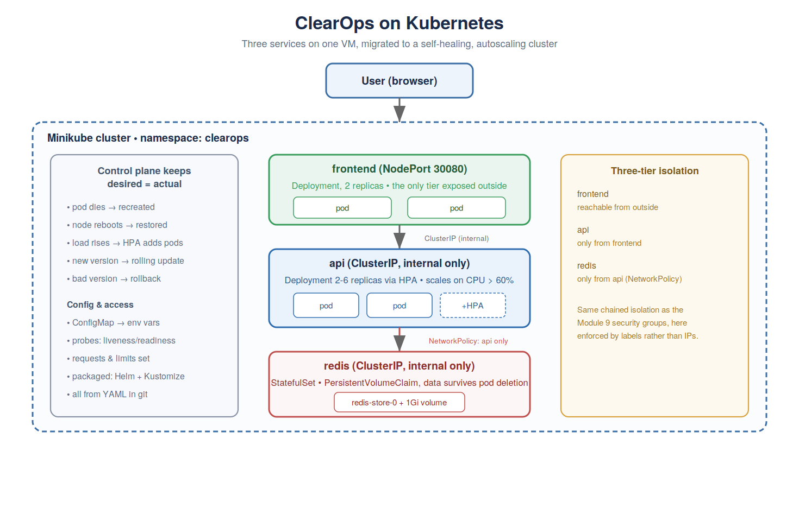

# Module 10: Container Orchestration with Kubernetes

ClearOps runs three containerised services, a frontend, an API, and a Redis cache, as bare
Docker containers on a single VM. When the VM restarts, all three go down together. When
the API gets busy, someone SSHes in and manually starts another container. It works until
nobody is watching, which at 2am is always.

This module rebuilds that setup on Kubernetes: a cluster that restarts crashed containers
on its own, scales the API under load without a human, and exposes each service exactly as
far as it should go, the frontend to the world, the API and Redis to nothing outside the
cluster.

*Three tiers on one cluster. The frontend is the only thing reachable from outside; the API
and Redis are internal, with the control plane keeping the whole thing matching its
description.*

## The shift: describe, don't instruct

Every tool up to now took commands. `docker run`, `git push`. Each does a thing once, and
if it fails or stops later, that is your problem to notice.

Kubernetes takes a description of what should be true, written in YAML, and works
continuously to keep reality matching it. You do not tell it to start a container. You tell
it "I want two API pods," and its control plane makes that true and keeps it true. A pod
dies, a replacement appears. A node reboots, the pods come back. Nobody is paged, because
noticing is no longer a human job.

The practical consequence catches everyone out: you cannot fix things by hand. Delete a pod
and Kubernetes immediately recreates it, because the description still says two. To change
what is running, you change the description.

## The building blocks

**Pods** wrap the containers. Nearly always one container each. The thing to know is that
they are disposable: replaced constantly, each with a new name and IP, and anything written
inside one is gone when it goes.

**Deployments** hold the desired replica count and manage the pods to match it. You never
create pods directly; you create a Deployment and let it do the work.

**Services** give a stable address in front of pods whose own addresses keep changing. The
frontend reaches the API at the name `clearops-api`, not an IP, because the cluster runs
its own DNS. Configuration stops containing addresses entirely, `REDIS_HOST` is just
`redis`, forever.

**Labels and selectors** are the glue. A Service does not name the pods it fronts; it says
"anything labelled `app: redis`," and the control plane keeps finding whatever currently
matches. Get the label and the selector out of step and a Deployment creates pods it then
cannot find, which is the most common beginner mistake in the whole system.

*The cluster running. The pods in kube-system are the control plane itself, running as pods
like everything else.*

*The three services with the exposure each needs: frontend on a NodePort, API and Redis
ClusterIP (internal only).*

## Self-healing

The feature that justifies the complexity. Delete an API pod and watch what happens:

*Delete a pod and a replacement is scheduled before the old one has finished terminating.
About twelve seconds from delete to serving traffic.*

Nothing responded to the delete specifically. The control plane compared the desired count
(2) against reality (1) on its next pass and closed the gap. In a Docker Compose setup that
container would simply be gone until a human noticed.

## Autoscaling

ClearOps's manual "SSH in and start another container" becomes a HorizontalPodAutoscaler:
keep average CPU near 60%, between 2 and 6 pods.

*Under load CPU hit 92%, and the autoscaler moved from 2 pods to 4 within seconds. It
calculated what was needed rather than jumping to the maximum.*

Scale-up is fast because being overwhelmed is urgent; scale-down waits several minutes,
deliberately, so pods do not flap in and out on spiky traffic. It depends on the
metrics-server for CPU data, and on the pods having resource requests set, without a
request there is no baseline to calculate a percentage against.

## Config, health, and safe updates

**A ConfigMap** feeds settings into the API as environment variables, so the same image
runs in any environment with different config.

*Settings injected from the ConfigMap, not baked into the image.*

**Probes** tell Kubernetes what "working" means. A readiness probe decides whether a pod
should receive traffic; a liveness probe decides whether a stuck pod should be killed and
replaced. Same idea as the Module 9 load balancer health check, plus the restart behaviour.

**Rolling updates** replace pods gradually, waiting for each new one to pass its readiness
probe before removing an old one, so there is never a gap in service. The readiness probe is
the safety catch: if a new version never passes, the rollout stops rather than destroying
working pods.

*Revision history, and a one-command rollback. Rollback adds a new revision rather than
deleting history, and history is finite, which is why the manifest in git, not the cluster's
memory, is the real source of truth.*

## State that survives

The API is stateless and interchangeable, which is what a Deployment is built for. Redis
holds data, and pods are disposable, so a plain Deployment loses everything on restart. I
proved it: wrote a value, deleted the pod, and the value was gone.

A StatefulSet fixes both halves. It gives the pod a stable identity (`redis-store-0`,
always) and a PersistentVolumeClaim (storage that outlives the pod). I ran the same
test, wrote a value, deleted the pod, and this time the pod came back with the same name,
reattached to the same volume, and the value was still there.

*The PersistentVolumeClaim bound to the StatefulSet pod. Storage tied to a specific identity.*

The honest caveat, carried from Module 9: running a real replicated database in Kubernetes
means handling leader election, replication and failover, which is genuinely hard. Most
teams use a managed database instead.

## Network isolation

By default every pod in a cluster can reach every other pod, in any namespace. So Redis,
even as a ClusterIP with no external exposure, was still reachable by anything in the
cluster. A NetworkPolicy fixes that:

*An unrelated pod trying to reach Redis: connection timed out. The API, which carries the
allowed label, still connects fine.*

Redis now accepts traffic from pods labelled `app: clearops-api` and from nothing else.
That is the same chained isolation as the Module 9 security groups, where the database only
accepted the app servers' security group, here enforced by labels instead of IPs. And the
same lesson applies: the moment a policy selects a pod it switches to deny-by-default, so a
policy that forgets to allow the traffic you need takes your own app down.

## Packaging: two ways

**Helm** packages the manifests into a chart with the changeable values pulled into
variables, and tracks each deploy as a versioned release with one-command rollback of the
whole thing at once.

*A Helm release through install, upgrade, and rollback, with the revision number climbing.*

**Kustomize** does the opposite: plain readable YAML with small patches layered per
environment, no templating, built into kubectl.

*One base, a dev overlay and a prod overlay differing only by the fields their patches name.*

The trade, which is a real interview question: Helm gives you release tracking and rollback
but its templated files are not valid YAML on their own; Kustomize files are plain and
apply without rendering but it has no release history. Helm for installing third-party
software where charts exist, Kustomize for your own apps where you want readable manifests.
Plenty of teams use both.

## Debugging

The most immediately useful skill in the module. The pod STATUS tells you the category of
failure; `kubectl describe` Events tell you the specific cause; logs only help once a
container has started. I broke the deployment on purpose to practise the sequence:

*A deliberate bad-image break. The Events section names the cause in one line:
ErrImageNeverPull, the image is not present and the policy says do not pull.*

The full seven-step sequence is written up in `runbooks/k8s-debug.md`.

## What this module covers

- A local cluster, and the control plane's reconcile loop that keeps desired = actual
- Pods, Deployments, ReplicaSets, and why you never create pods directly
- Services (ClusterIP, NodePort), cluster DNS, and labels/selectors as the glue
- Namespaces for organising a shared cluster
- Liveness and readiness probes; resource requests and limits
- Self-healing and horizontal autoscaling, both demonstrated
- Rolling updates and rollback, and why git is the real source of truth
- ConfigMaps and Secrets (and that Secrets are encoded, not encrypted)
- StatefulSets with persistent storage, proven to survive pod deletion
- NetworkPolicy for pod-to-pod isolation
- Packaging with Helm and with Kustomize, and when to use each
- A debug runbook for CrashLoopBackOff, ImagePullBackOff, Pending, OOMKilled, and probe failures
