# Module 11: Kubernetes on AWS with EKS

ClearOps proved the Kubernetes migration on a local Minikube cluster in Module 10.

This module takes it to production: Amazon EKS, AWS's managed Kubernetes. The application manifests barely change. What changes is who runs the control plane, how images are stored, how pods get AWS permissions, and how much attention the bill needs.

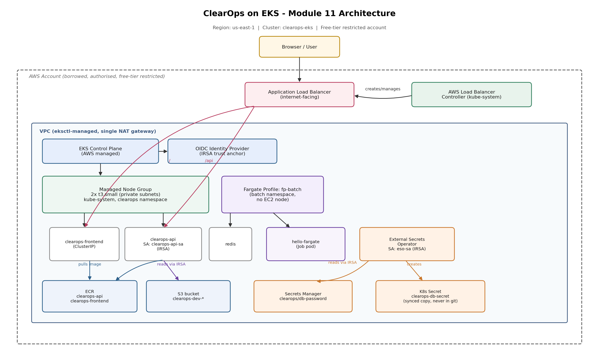
*ClearOps on EKS. AWS manages the control plane. A t3.small node group runs the pods in private subnets. An ALB created from an Ingress fronts the app. ECR holds the images. IRSA links pods to IAM roles. External Secrets pulls from Secrets Manager. A Fargate profile runs batch work with no node involved.*

## What this module proves

- A working EKS cluster with OIDC enabled, the identity layer everything else depends on
- The AWS Load Balancer Controller turning a Kubernetes Ingress into a real internet facing ALB
- IRSA (IAM Roles for Service Accounts): pods getting their own scoped AWS permissions with no access keys stored anywhere
- External Secrets Operator (ESO) pulling a secret from AWS Secrets Manager into the cluster, so the real value never touches git
- A Fargate profile running a pod with no EC2 node involved at all
- A full, verified teardown, so nothing keeps billing after the session ends

## What EKS changes, and what it does not

On Minikube I was responsible for everything, including the control plane running as those kube-system pods.

In production that is a full-time job. etcd has to be backed up and kept consistent. The API server has to stay highly available and patched. Upgrades have to be handled carefully.

EKS is AWS running all of that for me, for a flat fee, about $0.10 an hour, roughly $73 a month for the control plane alone. I keep the worker nodes and my manifests.

The payoff: my Deployments, Services, ConfigMap, and HPA from Module 10 ran on EKS almost untouched. Same Kubernetes, different management underneath, someone else carrying the hard part. Same logic as using RDS instead of running your own database.

## Images move to ECR

Minikube used images built into its own Docker daemon, with `imagePullPolicy: Never` telling it never to bother pulling from anywhere else.

EKS nodes are EC2 instances that can be replaced at any time, so images have to live in a registry the nodes can actually pull from. ECR is AWS's private registry for exactly that, same concept as Docker Hub or Nexus from earlier modules, integrated with IAM, with scan-on-push turned on.

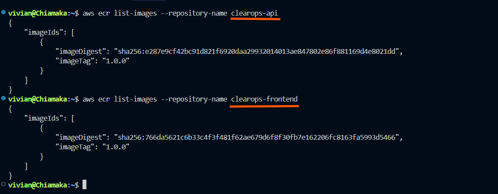
*Both ClearOps images pushed to ECR.*

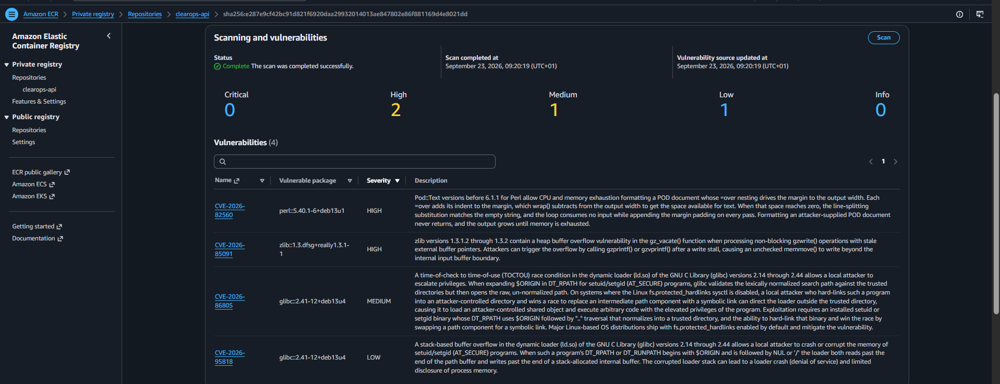
*Scan-on-push results. The findings sit in the Debian base image, not my own code, the same base-image CVE pattern from the Docker module.*

## The cluster, built from one config file

`eksctl` builds the whole cluster from a single YAML file: control plane, VPC, subnets across two availability zones, a NAT gateway, the node group, IAM roles, the OIDC provider, and the core addons. One command, about 20 minutes.

Two real lessons showed up before this session even started. The lab spec called for Kubernetes 1.30, which AWS had already retired by the time I got to it, so I moved to 1.32, one version below newest. That is the right production instinct anyway, run a version or two back from the bleeding edge, where the sharp corners are already sanded down.

The first cluster build also failed outright, because the account is free tier restricted and `t3.medium` is not a free tier instance type. The CloudFormation failure reason said exactly that. Switching to `t3.small`, which is eligible, fixed it. Reading the actual error instead of guessing turned out to be the whole skill there.

A budget alarm went in before any of this, non-negotiable on a borrowed account.

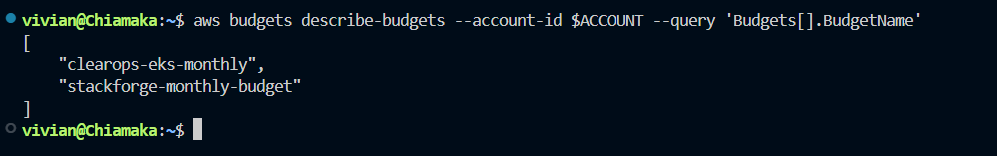
*The $15 monthly budget alarm, set before a single resource existed.*

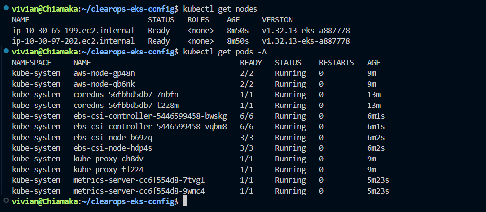
*Two t3.small nodes, both Ready.*

## The one genuinely new idea: IRSA

On Minikube, pods never needed AWS permissions, because there was no AWS in the picture.

On EKS it becomes central. How does a pod get permission to do AWS things without access keys baked into it anywhere? The wrong answer is keys sitting in a Secret, the mistake from Module 9. The too broad answer is a role attached to the node, because then every pod scheduled on that node inherits it, whether it needs it or not.

IRSA, IAM Roles for Service Accounts, is the actual answer. A pod assumes an IAM role by proving its Kubernetes identity through the cluster's OIDC provider, and gets back temporary, auto rotating AWS credentials scoped to that one pod. No keys stored anywhere, ever.

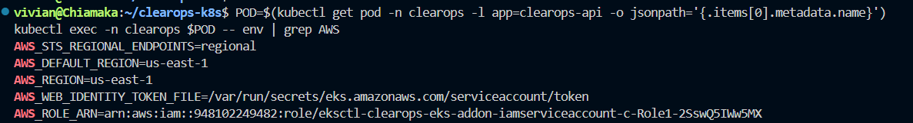
*Inside the pod: an AWS_ROLE_ARN and a web identity token, injected automatically. The pod has an IAM role and no access keys.*

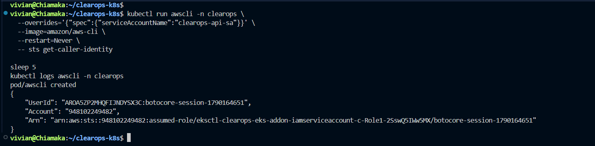
*The same pod running `sts get-caller-identity` and getting back an assumed role ARN, not a node role, not a static key. Proof the pod authenticated as itself.*

IRSA does the real work three separate times in this module: the load balancer controller, the app's own S3 access, and External Secrets. Each one uses `eksctl create iamserviceaccount`, which wires the IAM role, its trust policy, the Kubernetes service account, and the annotation, all in one command.

## Real load balancing from a manifest

The AWS Load Balancer Controller is a pod that watches for Ingress objects and creates real AWS ALBs to match them. The ALB I built by hand in Module 9, scheme, target type, health check path, all of it, is now three lines of annotation on an Ingress. The controller does the console work. It gets permission to create ALBs through its own IRSA identity.

That permission is worth double checking, and here is why. The IAM policy JSON for this controller is versioned against the controller itself. I pulled the policy from a `v2.7.2` tag, but Helm installed the current controller, `v3.5.0`. The newer controller calls an action, `elasticloadbalancing:DescribeListenerAttributes`, that the older policy never granted.

Nothing about the identity was broken. The role assumed correctly and the trust policy was fine. The ALB just sat with no address for several minutes while the controller quietly failed every attempt with an `AccessDenied`. The fix was pulling the current policy from `main` instead of a pinned tag, adding it as a new IAM policy version, and restarting the controller pods. Worth remembering: a working identity and a correctly permissioned identity are not the same thing.

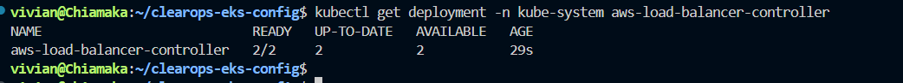
*The controller running in kube-system.*

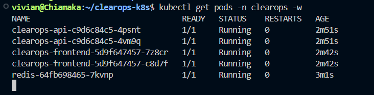
*All ClearOps pods running on EKS.*

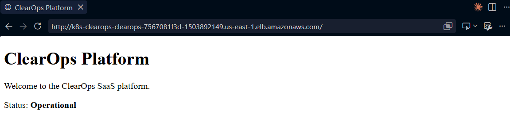
*The app reachable through the real ALB the controller provisioned straight from the Ingress.*

## Secrets that never touch git

Kubernetes Secrets are only base64 encoded, not encrypted. Anyone with repo access can decode one in a single line.

External Secrets Operator keeps the real value in AWS Secrets Manager, encrypted at rest, and syncs it into a Kubernetes Secret on demand. What lives in git is only a pointer, the name of the secret and which key to pull, never the value itself. ESO authenticates to Secrets Manager through its own IRSA identity, same pattern as everywhere else in this module.

Setting it up hit one more version snag. The `ClusterSecretStore` manifest used `external-secrets.io/v1beta1`, and Kubernetes rejected it with `no matches for kind`, an error that reads exactly like a missing CRD install. The CRDs were installed, every one of them, checked and confirmed. The real issue was one level more specific: that CRD still lists `v1beta1` as a known version, but the API server no longer serves it. `v1` is what is actually active. Checking `served: true/false` on the CRD directly, rather than assuming the whole install was broken, was the fix.

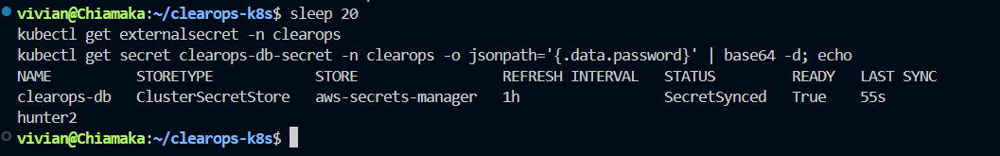
*The ExternalSecret synced, STATUS SecretSynced, with the value pulled live from Secrets Manager into the cluster.*

## Pods with no nodes

A Fargate profile says any pod in a chosen namespace runs on Fargate. AWS runs it with no node of mine involved at all, billed per pod per minute. Good for short or spiky work that would otherwise mean paying for a node that sits idle most of the time.

I ran a batch Job in a Fargate namespace and watched it schedule onto infrastructure that did not exist a moment earlier, a `fargate-` prefixed node rather than one of the t3.small nodes.

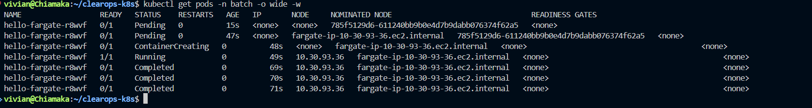
*A Job pod running on a Fargate node, not on the regular node group.*

## Cost discipline, which this module demands

EKS bills by the hour, and the control plane has no free tier and no pause button, only delete. So the whole module runs spin up and tear down in a single session.

Budget alarm first, before any resource exists. Teardown in strict reverse dependency order: delete the app and its Ingress first, so the controller removes the ALB on its own, confirm the ALB is actually gone, then delete the cluster, then clean up whatever the cluster delete does not touch on its own (standalone IAM policies, ECR repos, the S3 bucket).

Getting that order wrong orphans the ALB, which keeps billing with nothing left to remove it. One extra snag on the way out: an IAM policy that had picked up a second version, from the earlier fix, could not be deleted until that extra version was removed first. The full runbook, written before the build even started, is in `runbooks/eks-teardown.md`.

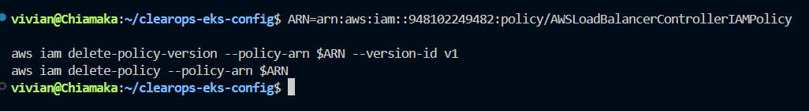
*Everything removed and verified. Cluster list empty, load balancer list empty, NAT gateway list empty.*

## How to reproduce

1. **Cluster**: apply `eksctl.yaml` with `eksctl create cluster -f eksctl.yaml`, confirm both nodes are `Ready`, and confirm the OIDC provider is registered in IAM.
2. **ALB Controller**: create the IAM policy from the current AWS Load Balancer Controller repo (not a pinned tag), wire it to an IRSA service account, install with Helm.
3. **Manifests**: copy the Minikube manifests into `k8s-eks/`, point images at ECR, drop `imagePullPolicy: Never`, swap the frontend Service from NodePort to ClusterIP plus an ALB Ingress.
4. **Deploy**: apply the manifests in order (namespace, redis, api, frontend), wait for the Ingress `ADDRESS` to populate.
5. **IRSA for the app**: create a scoped S3 read policy, an IRSA service account for the API, patch the deployment to use it.
6. **Secrets**: store a value in Secrets Manager, install ESO, give it its own IRSA identity, create a `ClusterSecretStore` and an `ExternalSecret` to sync the value in.
7. **Fargate**: create a Fargate profile targeting a namespace, run a pod there, confirm it lands on a `fargate-` node.
8. **Teardown**: follow `runbooks/eks-teardown.md`, same session as the build.

## What this module covers

- What EKS manages, the control plane, versus what you keep, nodes and manifests, and the cost model that comes with that split
- ECR as the AWS native image registry, with scan-on-push
- `eksctl` and a declarative cluster config, including choosing a supported, slightly back Kubernetes version
- OIDC and IRSA: per pod AWS identity with no stored keys, and the difference between an identity working and an identity having the right permissions
- The AWS Load Balancer Controller turning an Ingress into a real ALB
- External Secrets Operator syncing from AWS Secrets Manager, and checking `served` versions on a CRD before assuming something is missing
- Fargate profiles for nodeless pods
- Spin up and tear down cost discipline, in a tested, dependency aware order

More detail and honest reflection on both version mismatches in `retro.md`.

## Repo layout

```
11-eks/
├── README.md
├── architecture.png
├── retro.md
├── eksctl.yaml
├── runbooks/
│   └── eks-teardown.md
├── k8s-eks/
│   ├── api/
│   ├── common/
│   ├── frontend/
│   └── redis/
└── screenshots/
```
