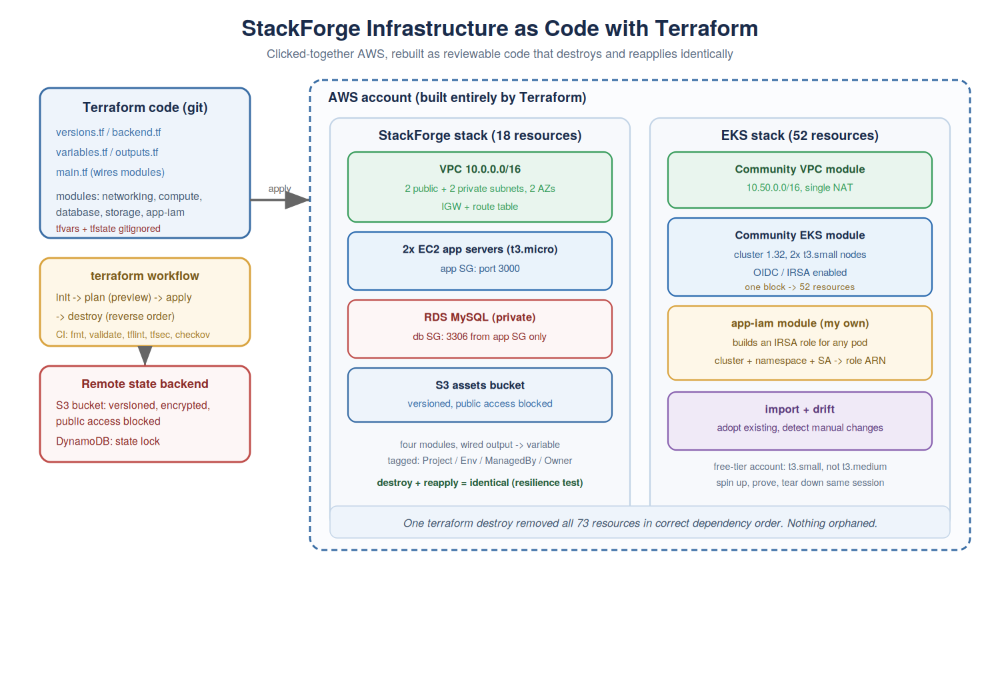

# Module 12: Infrastructure as Code with Terraform

StackForge built its AWS environment by clicking through the console. It worked, until a new
engineer joined and spent two days trying to recreate the dev environment from screenshots
and someone's memory. Nobody could reproduce it reliably, nobody could review a change before
it happened, and teardown was a hand-written list of delete steps you hoped was in the right
order.

This module rebuilds the whole thing as code. The same architecture, now described in files
that live in git, reviewed in pull requests, and created or destroyed with a single command.

*The StackForge stack built from Terraform modules, with state stored remotely in S3 and
locked with DynamoDB, plus an EKS cluster provisioned from the community module.*

## The shift: describe, do not click

Every tool before this touched AWS directly, the console, the CLI, eksctl. What you built
existed only in AWS, unreadable and unreproducible. Terraform inverts that. You describe the
infrastructure you want in HCL files, and Terraform makes reality match. It is the same
"declare the desired state, let the tool reconcile" idea from Kubernetes, one level down,
pointed at the cloud itself.

The workflow is the daily rhythm: `terraform plan` previews exactly what will change without
changing anything (the safety feature the console never gave me), `apply` makes it real after
I confirm, and `destroy` removes everything in the correct dependency order. The teardown that
failed by hand in earlier modules is now one reliable command.

## State, and why it lives in S3

Terraform keeps a record of everything it created, the state. It is how `plan` can tell
"create new" from "change existing." That state is precious (lose it and Terraform forgets
what it owns), secret (it holds the RDS password in plain text), and not to be hand-edited.

So the first thing built, before any infrastructure, was the remote state backend: an S3
bucket (versioned, encrypted, all public access blocked) holding the state, and a DynamoDB
table holding a lock so two people cannot apply at once and corrupt it. The backend is
bootstrapped by hand because Terraform cannot store its own state in a bucket that does not
exist yet.

*The state file living in S3, not on the laptop. Shared, encrypted, and locked.*

## The StackForge stack, as modules

The infrastructure is split into four modules, networking, compute, database, storage, each a
self-contained folder with its own variables (in) and outputs (out). The networking module
outputs the subnet and security-group IDs; compute and database take them in. Terraform reads
those references and works out the build order itself, networking first, then the rest.

*Eighteen resources, the entire Module 9 architecture, built from code with one command and
the outputs handed straight back.*

The whole stack is the architecture I built by clicking in Module 9: a VPC with public and
private subnets across two AZs, two chained security groups (the database accepts only the app
servers' group, by reference not IP), two app servers, RDS MySQL in the private subnets with
no public access, and a versioned, locked-down S3 bucket. The difference is that this version
is a folder of files anyone can read, review, and reproduce.

## The plan is the safety

The clearest demonstration of why this beats clicking: I changed the server count from two to
three and ran `plan`. It said "1 to add", not "rebuild everything", because state knew it
already had two. Scaling back said "1 to destroy". And when I pushed the count past the number
of subnets, `plan` caught the index error before anything was built, a real limitation of
`count` that a console would have let me stumble into live.

*A plan showing exactly what will change before anything does.*

## EKS from one module block

The entire Module 11 EKS saga, the cluster, node group, VPC, NAT, OIDC provider, dozens of
IAM roles, compressed into one `module "eks"` block from the community registry. Fifty-two
resources from about forty lines. The lesson of community modules in one plan: do not reinvent
infrastructure that thousands of people have already tested.

*A full EKS cluster, nodes Ready, provisioned entirely from Terraform.*

## Writing my own module: app-iam

Where a community module does not exist, you write your own. The `app-iam` module builds an
IRSA role for any pod, given a cluster, namespace, and service account, the same keyless
pod-to-AWS identity from Module 11, now reusable in one call.

*The app-iam module producing an IRSA role ARN, reusable for any service account.*

## Import and drift

Real accounts are not empty. `terraform import` adopts an existing resource into management
without recreating it, the migration path from clicked-together to managed-as-code. And drift,
when someone changes a resource by hand, is caught by `plan`, which shows the divergence
between code and reality.

*A hand-created bucket imported into Terraform, plan showing no changes.*

*A manual change surfaced by plan. The real fix is stopping manual changes, not just
re-applying.*

## Policy checks in CI

Five checks run on every pull request that touches a `.tf` file: `fmt` (formatting),
`validate` (syntax), `tflint` (likely mistakes), `tfsec` (security holes like a public
bucket or an open security group), and `checkov` (compliance policy). It is the shift-left
instinct from the Nexus and Docker modules, applied to infrastructure: catch the problem in
review, not in a breach.

*The five Terraform checks green on a pull request.*

## The resilience test

The headline proof of real Terraform discipline: destroy the whole environment, then apply it
back, and get something identical. If it survives that cycle, the infrastructure genuinely
lives in code rather than partly in things you clicked once and forgot.

*Destroyed and rebuilt from code, identical. The test every IaC setup should pass.*

## What this module covers

- Infrastructure as Code: describe infrastructure in files, reconcile with plan/apply/destroy
- Providers, HCL, resources, variables, outputs, data sources, locals
- State, and remote state in S3 with DynamoDB locking
- Modules: using community modules and authoring your own, wired output-to-variable
- count and for_each for repeated resources (and the count/subnet index gotcha)
- Sensitive variables and keeping secrets out of git and output (though still in state)
- terraform import and drift detection
- fmt / validate / tflint / tfsec / checkov in CI
- Destroy-and-reapply as the resilience test
